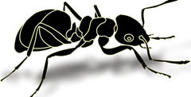
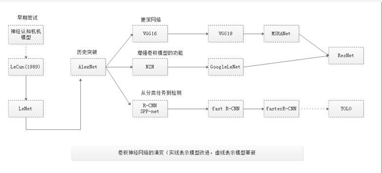

# Welcome to CNN learning

徐静

More learning: XuJing'Home [https://dataxujing.github.io/](https://dataxujing.github.io/)

关于CNN的基础知识及相关理论推导可以参考：<https://dataxujing.github.io/深度学习之CNN/>

----

关于LeNet-5,AlexNet,VGG16,VGG19这些网络结构我们在<https://dataxujing.github.io/深度学习之CNN/>中已经详细的解释，并且本教程中涉及的网路结构像ResNet,NIN,Inception,YOLO等也做了详细解释。本教程是对这些网络结构更详细的讨论。

----

- ResNet
- Google Inception
- R-CNN、图像特征提取、selective Search、SPP-net
- Fast R-CNN
- Faster R-CNN
- SSD
- Mask R-CNN
- YOLO
- FCN(反卷积),STNet,CNN与RNN的混合结构
- 关于